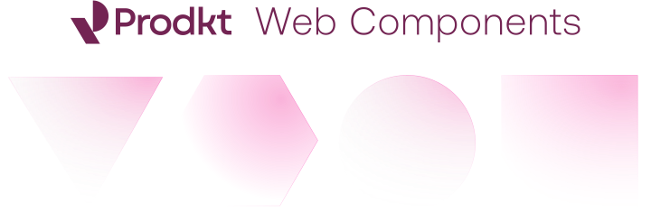

<div class="splash" style="background: rgba(125,125,125,.1); fill: 'currentColor'; display: flex; mix-blend-mode: difference; justify-content: center; align-items: center; padding-top: 3rem; padding-bottom: 3rem; min-height: 100vh;">

</div>

## Quick Start

Add the following code to your page.

<moyo-badge variant="warning">Coming Soon</moyo-badge>

```html
jsDelivr coming soon
```

Now you have access to all of Tovuti's components! Try adding a button:

```html preview expanded
<moyo-button>Click me</moyo-button>
```
